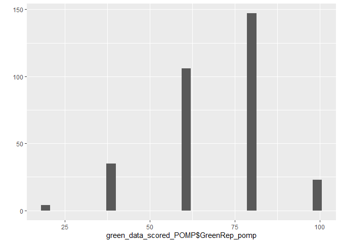
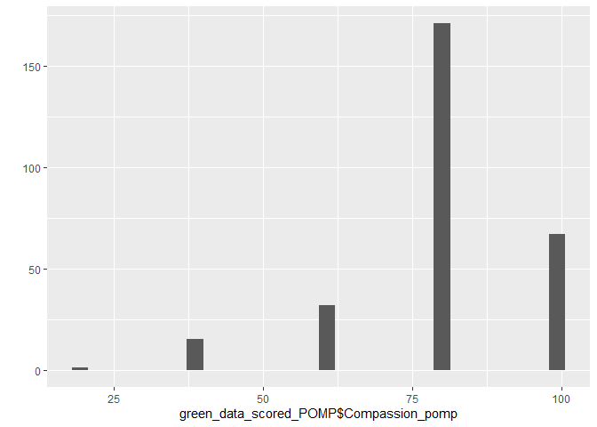
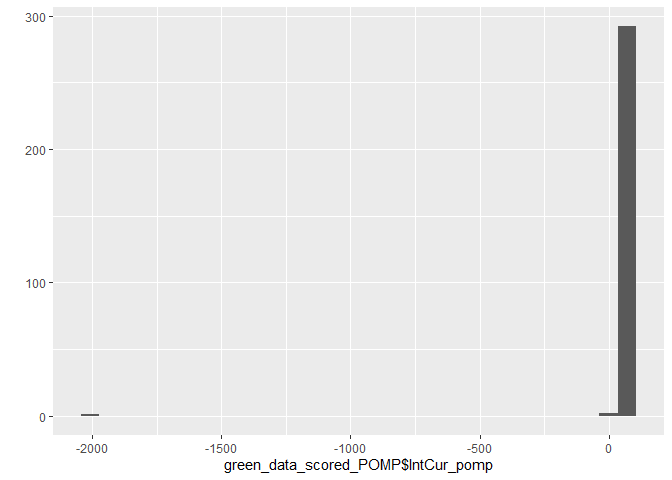
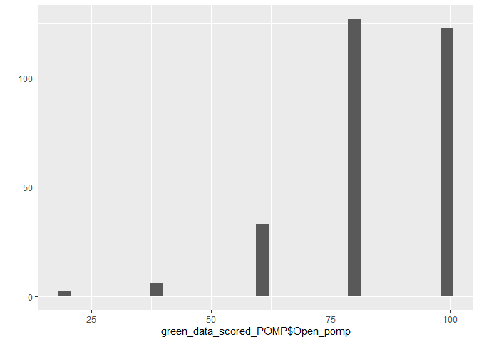
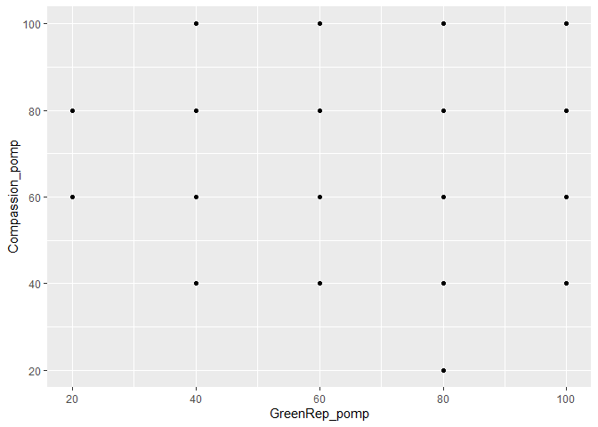
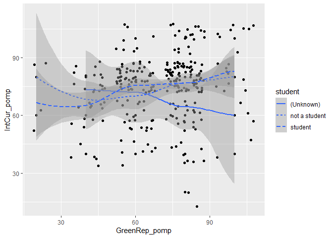
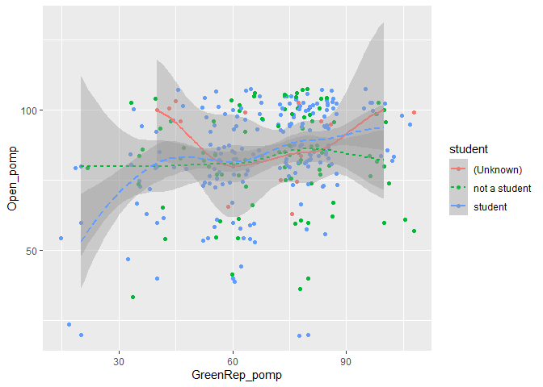
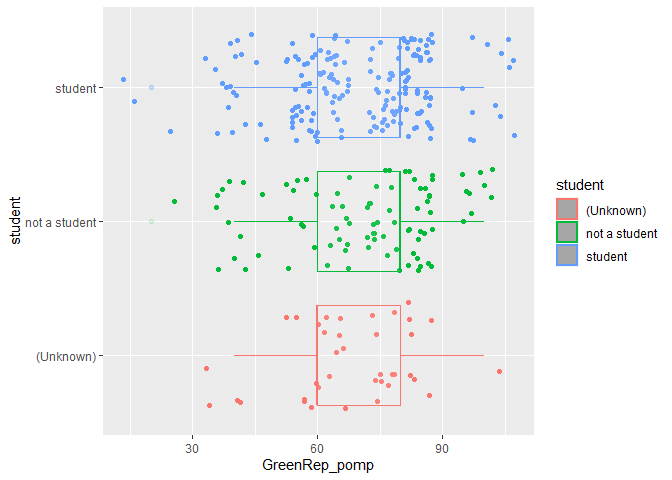

hw03
================
Sam Shepard
1/25/2021

# Homework 03

You will analyze data looking at the relationship between **green
reputation** and three personality traits–**compassion**, **intellectual
curiosity**, and **openness to experiences**. The dataset includes data
from **students** and **non-students**.

``` r
library(dplyr)
```

    ## 
    ## Attaching package: 'dplyr'

    ## The following objects are masked from 'package:stats':
    ## 
    ##     filter, lag

    ## The following objects are masked from 'package:base':
    ## 
    ##     intersect, setdiff, setequal, union

``` r
library(tidyverse)
```

    ## -- Attaching packages --------------------------------------- tidyverse 1.3.0 --

    ## v ggplot2 3.3.2     v purrr   0.3.4
    ## v tibble  3.0.4     v stringr 1.4.0
    ## v tidyr   1.1.2     v forcats 0.5.0
    ## v readr   1.4.0

    ## -- Conflicts ------------------------------------------ tidyverse_conflicts() --
    ## x dplyr::filter() masks stats::filter()
    ## x dplyr::lag()    masks stats::lag()

``` r
library(graphics)
library(ggplot2)
```

``` r
dictionary <- readr::read_csv("green_dictionary.csv")
```

    ## 
    ## -- Column specification --------------------------------------------------------
    ## cols(
    ##   Item = col_character(),
    ##   Content = col_character(),
    ##   Options = col_character(),
    ##   Keying = col_double()
    ## )

``` r
green_data <- readr::read_csv("green_data.csv")
```

    ## 
    ## -- Column specification --------------------------------------------------------
    ## cols(
    ##   .default = col_double(),
    ##   id = col_character()
    ## )
    ## i Use `spec()` for the full column specifications.

### 1\. Inspect the item responses (e.g., with graphs or by summarizing distinct values).

``` r
summary(green_data)
```

    ##       id                green1          green2         green3     
    ##  Length:373         Min.   :1.000   Min.   :1.00   Min.   :1.000  
    ##  Class :character   1st Qu.:3.000   1st Qu.:2.00   1st Qu.:3.000  
    ##  Mode  :character   Median :4.000   Median :3.00   Median :4.000  
    ##                     Mean   :3.476   Mean   :2.93   Mean   :3.797  
    ##                     3rd Qu.:4.000   3rd Qu.:4.00   3rd Qu.:4.000  
    ##                     Max.   :5.000   Max.   :5.00   Max.   :5.000  
    ##                     NA's   :58      NA's   :58     NA's   :58     
    ##      green4          green5          comp1             comp2        
    ##  Min.   :1.000   Min.   :1.000   Min.   :-99.000   Min.   :-99.000  
    ##  1st Qu.:3.000   1st Qu.:2.000   1st Qu.:  4.000   1st Qu.:  4.000  
    ##  Median :3.000   Median :3.000   Median :  4.000   Median :  4.000  
    ##  Mean   :3.238   Mean   :2.835   Mean   :  3.648   Mean   :  3.702  
    ##  3rd Qu.:4.000   3rd Qu.:4.000   3rd Qu.:  4.000   3rd Qu.:  4.500  
    ##  Max.   :5.000   Max.   :5.000   Max.   :  5.000   Max.   :  5.000  
    ##  NA's   :58      NA's   :58      NA's   :86        NA's   :78       
    ##      comp3           comp4             comp5             comp6      
    ##  Min.   :1.000   Min.   :-99.000   Min.   :-99.000   Min.   :1.000  
    ##  1st Qu.:4.000   1st Qu.:  4.000   1st Qu.:  4.000   1st Qu.:2.000  
    ##  Median :4.000   Median :  4.000   Median :  4.000   Median :2.000  
    ##  Mean   :4.267   Mean   :  3.691   Mean   :  3.319   Mean   :2.161  
    ##  3rd Qu.:5.000   3rd Qu.:  4.000   3rd Qu.:  4.000   3rd Qu.:3.000  
    ##  Max.   :5.000   Max.   :  5.000   Max.   :  5.000   Max.   :5.000  
    ##  NA's   :77      NA's   :85        NA's   :88        NA's   :81     
    ##      comp7            comp8             comp9             comp10       
    ##  Min.   :-99.00   Min.   :-99.000   Min.   :-99.000   Min.   :-99.000  
    ##  1st Qu.:  2.00   1st Qu.:  2.000   1st Qu.:  2.000   1st Qu.:  1.000  
    ##  Median :  2.00   Median :  2.000   Median :  2.000   Median :  2.000  
    ##  Mean   :  1.84   Mean   :  1.739   Mean   :  1.342   Mean   :  1.577  
    ##  3rd Qu.:  3.00   3rd Qu.:  2.000   3rd Qu.:  2.000   3rd Qu.:  2.000  
    ##  Max.   :  5.00   Max.   :  5.000   Max.   :  5.000   Max.   :  5.000  
    ##  NA's   :86       NA's   :90        NA's   :89        NA's   :89       
    ##      intel1           intel2            intel3            intel4       
    ##  Min.   :-99.00   Min.   :-99.000   Min.   :-99.000   Min.   :-99.000  
    ##  1st Qu.:  3.00   1st Qu.:  3.000   1st Qu.:  3.000   1st Qu.:  3.000  
    ##  Median :  4.00   Median :  4.000   Median :  4.000   Median :  4.000  
    ##  Mean   :  3.38   Mean   :  3.336   Mean   :  2.822   Mean   :  2.656  
    ##  3rd Qu.:  4.00   3rd Qu.:  4.000   3rd Qu.:  4.000   3rd Qu.:  4.000  
    ##  Max.   :  5.00   Max.   :  5.000   Max.   :  5.000   Max.   :  5.000  
    ##  NA's   :78       NA's   :90        NA's   :86        NA's   :88       
    ##      intel5            intel6            intel7            intel8       
    ##  Min.   :-99.000   Min.   :-99.000   Min.   :-99.000   Min.   :-99.000  
    ##  1st Qu.:  3.000   1st Qu.:  3.000   1st Qu.:  2.000   1st Qu.:  2.000  
    ##  Median :  4.000   Median :  4.000   Median :  2.000   Median :  2.000  
    ##  Mean   :  3.378   Mean   :  3.211   Mean   :  2.101   Mean   :  2.125  
    ##  3rd Qu.:  4.000   3rd Qu.:  4.000   3rd Qu.:  3.000   3rd Qu.:  3.000  
    ##  Max.   :  5.000   Max.   :  5.000   Max.   :  5.000   Max.   :  5.000  
    ##  NA's   :77        NA's   :89        NA's   :86        NA's   :78       
    ##      intel9           intel10            open1             open2        
    ##  Min.   :-99.000   Min.   :-99.000   Min.   :-99.000   Min.   :-99.000  
    ##  1st Qu.:  2.000   1st Qu.:  2.000   1st Qu.:  4.000   1st Qu.:  3.000  
    ##  Median :  2.000   Median :  2.000   Median :  4.000   Median :  4.000  
    ##  Mean   :  2.014   Mean   :  1.809   Mean   :  3.894   Mean   :  3.411  
    ##  3rd Qu.:  4.000   3rd Qu.:  3.000   3rd Qu.:  5.000   3rd Qu.:  4.000  
    ##  Max.   :  5.000   Max.   :  5.000   Max.   :  5.000   Max.   :  5.000  
    ##  NA's   :90        NA's   :90        NA's   :81        NA's   :81       
    ##      open3             open4             open5             open6        
    ##  Min.   :-99.000   Min.   :-99.000   Min.   :-99.000   Min.   :-99.000  
    ##  1st Qu.:  3.000   1st Qu.:  3.000   1st Qu.:  3.000   1st Qu.:  3.000  
    ##  Median :  4.000   Median :  4.000   Median :  4.000   Median :  4.000  
    ##  Mean   :  3.387   Mean   :  3.562   Mean   :  3.109   Mean   :  2.882  
    ##  3rd Qu.:  4.000   3rd Qu.:  5.000   3rd Qu.:  4.000   3rd Qu.:  4.000  
    ##  Max.   :  5.000   Max.   :  5.000   Max.   :  5.000   Max.   :  5.000  
    ##  NA's   :89        NA's   :85        NA's   :88        NA's   :84       
    ##      open7             open8           open9           open10      
    ##  Min.   :-99.000   Min.   :1.000   Min.   :1.000   Min.   :-99.00  
    ##  1st Qu.:  2.000   1st Qu.:2.000   1st Qu.:2.000   1st Qu.:  2.00  
    ##  Median :  3.000   Median :2.000   Median :2.000   Median :  2.00  
    ##  Mean   :  2.274   Mean   :2.599   Mean   :2.568   Mean   :  2.36  
    ##  3rd Qu.:  4.000   3rd Qu.:3.000   3rd Qu.:4.000   3rd Qu.:  4.00  
    ##  Max.   :  5.000   Max.   :5.000   Max.   :5.000   Max.   :  5.00  
    ##  NA's   :85        NA's   :84      NA's   :77      NA's   :90      
    ##     student       
    ##  Min.   :-99.000  
    ##  1st Qu.:  1.000  
    ##  Median :  2.000  
    ##  Mean   :  1.309  
    ##  3rd Qu.:  2.000  
    ##  Max.   :  2.000  
    ##  NA's   :95

### Is anything unusual?

**Missing values are coded as -99; below is the code to change the -99
values to “missing.”**

``` r
green_data_missing <- green_data %>% 
mutate(
  across(.cols = everything (),
         ~ na_if(.x, "-99")
  ))

#Notes from class:
#everything = ALL COLUMNS
#~ = opens up for using ".x"
#.x = the current column
```

### 2\. Reverse-coding, recoding categorical variable, and creating total scores.

``` r
#the across functions were not agreeing with me, so I just went with this super long thing.


green_data_scored <- green_data_missing %>% 
  mutate(
   green2r = recode(green2, "1" = "5", "2" = "4", "3" = "3", "4" = "2", "5" = "1", .missing = "(Unknown)"),
   comp6r = recode(comp6, "1" = "5", "2" = "4", "3" = "3", "4" = "2", "5" = "1", .missing = "(Unknown)"),
   comp7r = recode(comp7, "1" = "5", "2" = "4", "3" = "3", "4" = "2", "5" = "1", .missing = "(Unknown)"),
   comp8r = recode(comp8, "1" = "5", "2" = "4", "3" = "3", "4" = "2", "5" = "1", .missing = "(Unknown)"),
   comp9r = recode(comp9, "1" = "5", "2" = "4", "3" = "3", "4" = "2", "5" = "1", .missing = "(Unknown)"),
   comp10r = recode(comp10, "1" = "5", "2" = "4", "3" = "3", "4" = "2", "5" = "1", .missing = "(Unknown)"),
   intel7r = recode(intel7, "1" = "5", "2" = "4", "3" = "3", "4" = "2", "5" = "1", .missing = "(Unknown)"),
   intel8r = recode(intel8, "1" = "5", "2" = "4", "3" = "3", "4" = "2", "5" = "1", .missing = "(Unknown)"),
   intel9r = recode(intel9, "1" = "5", "2" = "4", "3" = "3", "4" = "2", "5" = "1", .missing = "(Unknown)"),
   intel10r = recode(intel10, "1" = "5", "2" = "4", "3" = "3", "4" = "2", "5" = "1", .missing = "(Unknown)"),
   open7r = recode(open7, "1" = "5", "2" = "4", "3" = "3", "4" = "2", "5" = "1", .missing = "(Unknown)"),
   open8r = recode(open8, "1" = "5", "2" = "4", "3" = "3", "4" = "2", "5" = "1", .missing = "(Unknown)"),
   open9r = recode(open9, "1" = "5", "2" = "4", "3" = "3", "4" = "2", "5" = "1", .missing = "(Unknown)"),
   open10r = recode(open10, "1" = "5", "2" = "4", "3" = "3", "4" = "2", "5" = "1", .missing = "(Unknown)"),
   student = recode(student, "1" = "not a student", "2" = "student", .missing = "(Unknown)")
  ) %>%

  rowwise() %>% 
  mutate(
          GreenRep = mean(green1, green2r, green3, green4, green5, trim = 0, na.rm = TRUE),
          Compassion = mean(comp1, comp2, comp3, comp4, comp5, comp6r, comp7r, comp8r, comp9r, comp10r, trim = 0, na.rm = TRUE),
          IntCur = mean(intel1, intel2, intel3, intel4, intel5, intel6, intel7r, intel8r, intel9r, intel10r, trim = 0, na.rm = TRUE),
          Open = mean(open1, open2, open3, open4, open5, open6, open7r, open8r, open9r, open10r, trim = 0, na.rm = TRUE)) %>% 
        
  select(id, student, green2, green2r, comp6, comp6r, intel7, intel7r, open7, open7r, GreenRep, Compassion, IntCur, Open)

#The table that populates doesn't show the decimals for the total scores?
```

### 3\. Rescale the variables so that they go from 0-100 instead of the original range. Name the rescaled variables `*_pomp`.

``` r
green_data_scored_POMP <- green_data_scored %>% 
mutate(
GreenRep_pomp = (GreenRep * 20),
Compassion_pomp = (Compassion * 20),
IntCur_pomp = (IntCur * 20),
Open_pomp = (Open * 20)
) %>% 

select(id, student, GreenRep_pomp, Compassion_pomp, IntCur_pomp, Open_pomp)
```

### 4\. Make plots that illustrate the distributions of the 4 POMP-scored variables.

**Overall, participants are high in compassion, intellectual curiosity,
and openness to experience. The data for green reputation is more
normally distributed.**

``` r
qplot(green_data_scored_POMP$GreenRep_pomp, geom="histogram")
```

    ## `stat_bin()` using `bins = 30`. Pick better value with `binwidth`.

    ## Warning: Removed 58 rows containing non-finite values (stat_bin).

<!-- -->

``` r
qplot(green_data_scored_POMP$Compassion_pomp, geom="histogram")
```

    ## `stat_bin()` using `bins = 30`. Pick better value with `binwidth`.

    ## Warning: Removed 87 rows containing non-finite values (stat_bin).

<!-- -->

``` r
qplot(green_data_scored_POMP$IntCur_pomp, geom="histogram")
```

    ## `stat_bin()` using `bins = 30`. Pick better value with `binwidth`.

    ## Warning: Removed 79 rows containing non-finite values (stat_bin).

<!-- -->

``` r
qplot(green_data_scored_POMP$Open_pomp, geom="histogram")
```

    ## `stat_bin()` using `bins = 30`. Pick better value with `binwidth`.

    ## Warning: Removed 82 rows containing non-finite values (stat_bin).

<!-- -->

### 5\. Make scatterplots showing the relationships between **green reputation** and each personality trait. Include trend lines for **students** and **non-students**.

**Write narrative here once the student lines are figured out**

**Compassion & Green Reputation**

``` r
green_data_scored_POMP %>% 
ggplot() +
  aes(GreenRep_pomp, Compassion_pomp, linetype = student) +
  geom_point() +
  geom_jitter() +
  geom_smooth()
```

    ## `geom_smooth()` using method = 'loess' and formula 'y ~ x'

    ## Warning: Removed 87 rows containing non-finite values (stat_smooth).

    ## Warning in simpleLoess(y, x, w, span, degree = degree, parametric =
    ## parametric, : pseudoinverse used at 39.7

    ## Warning in simpleLoess(y, x, w, span, degree = degree, parametric =
    ## parametric, : neighborhood radius 40.3

    ## Warning in simpleLoess(y, x, w, span, degree = degree, parametric =
    ## parametric, : reciprocal condition number 4.9734e-017

    ## Warning in simpleLoess(y, x, w, span, degree = degree, parametric =
    ## parametric, : There are other near singularities as well. 1624.1

    ## Warning in predLoess(object$y, object$x, newx = if
    ## (is.null(newdata)) object$x else if (is.data.frame(newdata))
    ## as.matrix(model.frame(delete.response(terms(object)), : pseudoinverse used at
    ## 39.7

    ## Warning in predLoess(object$y, object$x, newx = if
    ## (is.null(newdata)) object$x else if (is.data.frame(newdata))
    ## as.matrix(model.frame(delete.response(terms(object)), : neighborhood radius 40.3

    ## Warning in predLoess(object$y, object$x, newx = if
    ## (is.null(newdata)) object$x else if (is.data.frame(newdata))
    ## as.matrix(model.frame(delete.response(terms(object)), : reciprocal condition
    ## number 4.9734e-017

    ## Warning in predLoess(object$y, object$x, newx = if
    ## (is.null(newdata)) object$x else if (is.data.frame(newdata))
    ## as.matrix(model.frame(delete.response(terms(object)), : There are other near
    ## singularities as well. 1624.1

    ## Warning in simpleLoess(y, x, w, span, degree = degree, parametric =
    ## parametric, : pseudoinverse used at 100.4

    ## Warning in simpleLoess(y, x, w, span, degree = degree, parametric =
    ## parametric, : neighborhood radius 40.4

    ## Warning in simpleLoess(y, x, w, span, degree = degree, parametric =
    ## parametric, : reciprocal condition number 3.4741e-016

    ## Warning in simpleLoess(y, x, w, span, degree = degree, parametric =
    ## parametric, : There are other near singularities as well. 400

    ## Warning in predLoess(object$y, object$x, newx = if
    ## (is.null(newdata)) object$x else if (is.data.frame(newdata))
    ## as.matrix(model.frame(delete.response(terms(object)), : pseudoinverse used at
    ## 100.4

    ## Warning in predLoess(object$y, object$x, newx = if
    ## (is.null(newdata)) object$x else if (is.data.frame(newdata))
    ## as.matrix(model.frame(delete.response(terms(object)), : neighborhood radius 40.4

    ## Warning in predLoess(object$y, object$x, newx = if
    ## (is.null(newdata)) object$x else if (is.data.frame(newdata))
    ## as.matrix(model.frame(delete.response(terms(object)), : reciprocal condition
    ## number 3.4741e-016

    ## Warning in predLoess(object$y, object$x, newx = if
    ## (is.null(newdata)) object$x else if (is.data.frame(newdata))
    ## as.matrix(model.frame(delete.response(terms(object)), : There are other near
    ## singularities as well. 400

    ## Warning in simpleLoess(y, x, w, span, degree = degree, parametric =
    ## parametric, : pseudoinverse used at 100.4

    ## Warning in simpleLoess(y, x, w, span, degree = degree, parametric =
    ## parametric, : neighborhood radius 40.4

    ## Warning in simpleLoess(y, x, w, span, degree = degree, parametric =
    ## parametric, : reciprocal condition number 1.4218e-016

    ## Warning in simpleLoess(y, x, w, span, degree = degree, parametric =
    ## parametric, : There are other near singularities as well. 400

    ## Warning in predLoess(object$y, object$x, newx = if
    ## (is.null(newdata)) object$x else if (is.data.frame(newdata))
    ## as.matrix(model.frame(delete.response(terms(object)), : pseudoinverse used at
    ## 100.4

    ## Warning in predLoess(object$y, object$x, newx = if
    ## (is.null(newdata)) object$x else if (is.data.frame(newdata))
    ## as.matrix(model.frame(delete.response(terms(object)), : neighborhood radius 40.4

    ## Warning in predLoess(object$y, object$x, newx = if
    ## (is.null(newdata)) object$x else if (is.data.frame(newdata))
    ## as.matrix(model.frame(delete.response(terms(object)), : reciprocal condition
    ## number 1.4218e-016

    ## Warning in predLoess(object$y, object$x, newx = if
    ## (is.null(newdata)) object$x else if (is.data.frame(newdata))
    ## as.matrix(model.frame(delete.response(terms(object)), : There are other near
    ## singularities as well. 400

    ## Warning: Removed 87 rows containing missing values (geom_point).
    
    ## Warning: Removed 87 rows containing missing values (geom_point).

<!-- -->

``` r
#I tried geom_line(), but that turned out absolutely horrific, so I went with geom_smooth for this draft.
```

**Intellectual Curiosity & Green Reputation**

``` r
green_data_scored_POMP %>% 
ggplot() +
  aes(GreenRep_pomp, IntCur_pomp, linetype = student) +
  geom_point() +
  geom_jitter() +
  geom_smooth()
```

    ## `geom_smooth()` using method = 'loess' and formula 'y ~ x'

    ## Warning: Removed 79 rows containing non-finite values (stat_smooth).

    ## Warning in simpleLoess(y, x, w, span, degree = degree, parametric =
    ## parametric, : pseudoinverse used at 39.7

    ## Warning in simpleLoess(y, x, w, span, degree = degree, parametric =
    ## parametric, : neighborhood radius 40.3

    ## Warning in simpleLoess(y, x, w, span, degree = degree, parametric =
    ## parametric, : reciprocal condition number 5.4871e-017

    ## Warning in simpleLoess(y, x, w, span, degree = degree, parametric =
    ## parametric, : There are other near singularities as well. 1624.1

    ## Warning in predLoess(object$y, object$x, newx = if
    ## (is.null(newdata)) object$x else if (is.data.frame(newdata))
    ## as.matrix(model.frame(delete.response(terms(object)), : pseudoinverse used at
    ## 39.7

    ## Warning in predLoess(object$y, object$x, newx = if
    ## (is.null(newdata)) object$x else if (is.data.frame(newdata))
    ## as.matrix(model.frame(delete.response(terms(object)), : neighborhood radius 40.3

    ## Warning in predLoess(object$y, object$x, newx = if
    ## (is.null(newdata)) object$x else if (is.data.frame(newdata))
    ## as.matrix(model.frame(delete.response(terms(object)), : reciprocal condition
    ## number 5.4871e-017

    ## Warning in predLoess(object$y, object$x, newx = if
    ## (is.null(newdata)) object$x else if (is.data.frame(newdata))
    ## as.matrix(model.frame(delete.response(terms(object)), : There are other near
    ## singularities as well. 1624.1

    ## Warning in simpleLoess(y, x, w, span, degree = degree, parametric =
    ## parametric, : pseudoinverse used at 100.4

    ## Warning in simpleLoess(y, x, w, span, degree = degree, parametric =
    ## parametric, : neighborhood radius 40.4

    ## Warning in simpleLoess(y, x, w, span, degree = degree, parametric =
    ## parametric, : reciprocal condition number 3.4741e-016

    ## Warning in simpleLoess(y, x, w, span, degree = degree, parametric =
    ## parametric, : There are other near singularities as well. 400

    ## Warning in predLoess(object$y, object$x, newx = if
    ## (is.null(newdata)) object$x else if (is.data.frame(newdata))
    ## as.matrix(model.frame(delete.response(terms(object)), : pseudoinverse used at
    ## 100.4

    ## Warning in predLoess(object$y, object$x, newx = if
    ## (is.null(newdata)) object$x else if (is.data.frame(newdata))
    ## as.matrix(model.frame(delete.response(terms(object)), : neighborhood radius 40.4

    ## Warning in predLoess(object$y, object$x, newx = if
    ## (is.null(newdata)) object$x else if (is.data.frame(newdata))
    ## as.matrix(model.frame(delete.response(terms(object)), : reciprocal condition
    ## number 3.4741e-016

    ## Warning in predLoess(object$y, object$x, newx = if
    ## (is.null(newdata)) object$x else if (is.data.frame(newdata))
    ## as.matrix(model.frame(delete.response(terms(object)), : There are other near
    ## singularities as well. 400

    ## Warning in simpleLoess(y, x, w, span, degree = degree, parametric =
    ## parametric, : pseudoinverse used at 100.4

    ## Warning in simpleLoess(y, x, w, span, degree = degree, parametric =
    ## parametric, : neighborhood radius 40.4

    ## Warning in simpleLoess(y, x, w, span, degree = degree, parametric =
    ## parametric, : reciprocal condition number 1.4218e-016

    ## Warning in simpleLoess(y, x, w, span, degree = degree, parametric =
    ## parametric, : There are other near singularities as well. 400

    ## Warning in predLoess(object$y, object$x, newx = if
    ## (is.null(newdata)) object$x else if (is.data.frame(newdata))
    ## as.matrix(model.frame(delete.response(terms(object)), : pseudoinverse used at
    ## 100.4

    ## Warning in predLoess(object$y, object$x, newx = if
    ## (is.null(newdata)) object$x else if (is.data.frame(newdata))
    ## as.matrix(model.frame(delete.response(terms(object)), : neighborhood radius 40.4

    ## Warning in predLoess(object$y, object$x, newx = if
    ## (is.null(newdata)) object$x else if (is.data.frame(newdata))
    ## as.matrix(model.frame(delete.response(terms(object)), : reciprocal condition
    ## number 1.4218e-016

    ## Warning in predLoess(object$y, object$x, newx = if
    ## (is.null(newdata)) object$x else if (is.data.frame(newdata))
    ## as.matrix(model.frame(delete.response(terms(object)), : There are other near
    ## singularities as well. 400

    ## Warning: Removed 79 rows containing missing values (geom_point).
    
    ## Warning: Removed 79 rows containing missing values (geom_point).

<!-- -->

**Openness to Experience & Green Reputation**

``` r
green_data_scored_POMP %>% 
ggplot() +
  aes(GreenRep_pomp, Open_pomp, linetype = student, color = student) +
  geom_point() +
  geom_jitter() +
  geom_smooth()
```

    ## `geom_smooth()` using method = 'loess' and formula 'y ~ x'

    ## Warning: Removed 82 rows containing non-finite values (stat_smooth).

    ## Warning in simpleLoess(y, x, w, span, degree = degree, parametric =
    ## parametric, : pseudoinverse used at 39.7

    ## Warning in simpleLoess(y, x, w, span, degree = degree, parametric =
    ## parametric, : neighborhood radius 40.3

    ## Warning in simpleLoess(y, x, w, span, degree = degree, parametric =
    ## parametric, : reciprocal condition number 1.224e-017

    ## Warning in simpleLoess(y, x, w, span, degree = degree, parametric =
    ## parametric, : There are other near singularities as well. 1624.1

    ## Warning in predLoess(object$y, object$x, newx = if
    ## (is.null(newdata)) object$x else if (is.data.frame(newdata))
    ## as.matrix(model.frame(delete.response(terms(object)), : pseudoinverse used at
    ## 39.7

    ## Warning in predLoess(object$y, object$x, newx = if
    ## (is.null(newdata)) object$x else if (is.data.frame(newdata))
    ## as.matrix(model.frame(delete.response(terms(object)), : neighborhood radius 40.3

    ## Warning in predLoess(object$y, object$x, newx = if
    ## (is.null(newdata)) object$x else if (is.data.frame(newdata))
    ## as.matrix(model.frame(delete.response(terms(object)), : reciprocal condition
    ## number 1.224e-017

    ## Warning in predLoess(object$y, object$x, newx = if
    ## (is.null(newdata)) object$x else if (is.data.frame(newdata))
    ## as.matrix(model.frame(delete.response(terms(object)), : There are other near
    ## singularities as well. 1624.1

    ## Warning in simpleLoess(y, x, w, span, degree = degree, parametric =
    ## parametric, : pseudoinverse used at 100.4

    ## Warning in simpleLoess(y, x, w, span, degree = degree, parametric =
    ## parametric, : neighborhood radius 40.4

    ## Warning in simpleLoess(y, x, w, span, degree = degree, parametric =
    ## parametric, : reciprocal condition number 2.2382e-016

    ## Warning in simpleLoess(y, x, w, span, degree = degree, parametric =
    ## parametric, : There are other near singularities as well. 400

    ## Warning in predLoess(object$y, object$x, newx = if
    ## (is.null(newdata)) object$x else if (is.data.frame(newdata))
    ## as.matrix(model.frame(delete.response(terms(object)), : pseudoinverse used at
    ## 100.4

    ## Warning in predLoess(object$y, object$x, newx = if
    ## (is.null(newdata)) object$x else if (is.data.frame(newdata))
    ## as.matrix(model.frame(delete.response(terms(object)), : neighborhood radius 40.4

    ## Warning in predLoess(object$y, object$x, newx = if
    ## (is.null(newdata)) object$x else if (is.data.frame(newdata))
    ## as.matrix(model.frame(delete.response(terms(object)), : reciprocal condition
    ## number 2.2382e-016

    ## Warning in predLoess(object$y, object$x, newx = if
    ## (is.null(newdata)) object$x else if (is.data.frame(newdata))
    ## as.matrix(model.frame(delete.response(terms(object)), : There are other near
    ## singularities as well. 400

    ## Warning in simpleLoess(y, x, w, span, degree = degree, parametric =
    ## parametric, : pseudoinverse used at 100.4

    ## Warning in simpleLoess(y, x, w, span, degree = degree, parametric =
    ## parametric, : neighborhood radius 40.4

    ## Warning in simpleLoess(y, x, w, span, degree = degree, parametric =
    ## parametric, : reciprocal condition number 4.0652e-016

    ## Warning in simpleLoess(y, x, w, span, degree = degree, parametric =
    ## parametric, : There are other near singularities as well. 400

    ## Warning in predLoess(object$y, object$x, newx = if
    ## (is.null(newdata)) object$x else if (is.data.frame(newdata))
    ## as.matrix(model.frame(delete.response(terms(object)), : pseudoinverse used at
    ## 100.4

    ## Warning in predLoess(object$y, object$x, newx = if
    ## (is.null(newdata)) object$x else if (is.data.frame(newdata))
    ## as.matrix(model.frame(delete.response(terms(object)), : neighborhood radius 40.4

    ## Warning in predLoess(object$y, object$x, newx = if
    ## (is.null(newdata)) object$x else if (is.data.frame(newdata))
    ## as.matrix(model.frame(delete.response(terms(object)), : reciprocal condition
    ## number 4.0652e-016

    ## Warning in predLoess(object$y, object$x, newx = if
    ## (is.null(newdata)) object$x else if (is.data.frame(newdata))
    ## as.matrix(model.frame(delete.response(terms(object)), : There are other near
    ## singularities as well. 400

    ## Warning: Removed 82 rows containing missing values (geom_point).
    
    ## Warning: Removed 82 rows containing missing values (geom_point).

<!-- -->

### 6\. Compare **green reputation** for students and non-students using a **rainfall plot** (bar + density + data points).

**The rainfall plot indicates that the distributions for students and
non-students are very similar.**

``` r
green_data_scored_POMP %>%
ggplot() +
  aes(y = student, x = GreenRep_pomp, na.omit, color = student) +
  geom_jitter() +
  geom_boxplot(alpha = .1) +
  ggdist::stat_slab()
```

    ## Warning: Removed 58 rows containing non-finite values (stat_boxplot).

    ## Warning: Computation failed in `stat_slab()`:
    ## 'x' contains missing values

    ## Warning: Removed 58 rows containing missing values (geom_point).

<!-- -->

### 7\. Compute a summary table of means, SDs, medians, minima, and maxima for the four total scores for students and non-students.

**Write narrative description after figuring out what is wrong with this
summary table**

``` r
green_data_scored_POMP %>% 
  group_by(student) %>% 
  summarize(GreenRep_M = mean(GreenRep_pomp),
            GreenRep_SD = sd(GreenRep_pomp),
            GreenRep_Med = median(GreenRep_pomp),
            GreenRep_Min = min(GreenRep_pomp),
            GreenRep_Max = max(GreenRep_pomp),
            Compassion_M = mean(Compassion_pomp),
            Compassion_SD = sd(Compassion_pomp),
            Compassion_Med = median(Compassion_pomp),
            Compassion_Min = min(Compassion_pomp),
            Compassion_Max = max(Compassion_pomp),
            IntCur_M = mean(IntCur_pomp),
            IntCur_SD = sd(IntCur_pomp),
            IntCur_Med = median(IntCur_pomp),
            IntCur_Min = min(IntCur_pomp),
            IntCur_Max = max(IntCur_pomp),
            Open_M = mean(Open_pomp),
            Open_SD = sd(Open_pomp),
            Open_Med = median(Open_pomp),
            Open_Min = min(Open_pomp),
            Open_Max = max(Open_pomp))
```

    ## `summarise()` ungrouping output (override with `.groups` argument)

    ## # A tibble: 3 x 21
    ##   student GreenRep_M GreenRep_SD GreenRep_Med GreenRep_Min GreenRep_Max
    ##   <chr>        <dbl>       <dbl>        <dbl>        <dbl>        <dbl>
    ## 1 (Unkno~      NaN          NA             NA          NaN          NaN
    ## 2 not a ~       70.8        17.7           80           20          100
    ## 3 student       69.2        16.7           80           20          100
    ## # ... with 15 more variables: Compassion_M <dbl>, Compassion_SD <dbl>,
    ## #   Compassion_Med <dbl>, Compassion_Min <dbl>, Compassion_Max <dbl>,
    ## #   IntCur_M <dbl>, IntCur_SD <dbl>, IntCur_Med <dbl>, IntCur_Min <dbl>,
    ## #   IntCur_Max <dbl>, Open_M <dbl>, Open_SD <dbl>, Open_Med <dbl>,
    ## #   Open_Min <dbl>, Open_Max <dbl>

``` r
#Most of the values in this summary table read, "NA" or "NaN"
```
