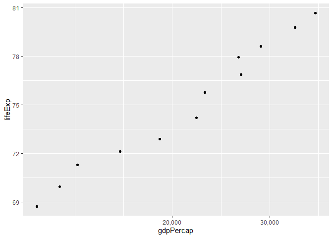
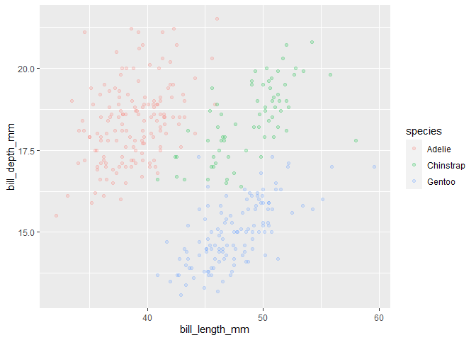
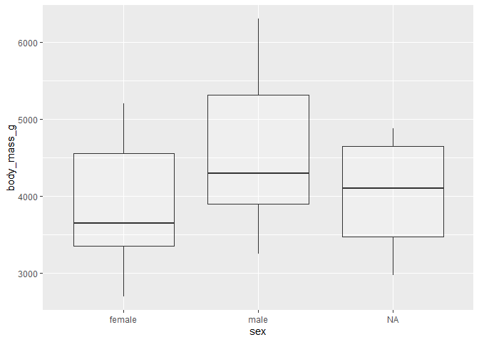

hw02
================
Sam Shepard
2/4/2021

## Directions etc.

Assignment 02: Explore gapminder and use dplyr Jan 1, 0001 Objective The
goal is to practice with ggplot2 and dplyr to explore a dataset.

Setup Work with the gapminder::gapminder data we explored in class.

Load up the packages you will need for this assignment using library():

Tidy Submission Please be sure to follow the instructions for making a
tidy submission, found on the assignments home page.

Exercise 1: Basic dplyr Use dplyr functions to achieve the following.

## 1.1

Use filter() to subset the gapminder data to three countries of your
choice in the 1970’s.

``` r
samcountries <- gapminder %>%
  filter(country %in% c("Cuba", "Vietnam", "China") & year > 1969 & year < 1981)
```

1.2 Use the pipe operator %\>% to select “country” and “gdpPercap” from
your filtered dataset in 1.1.

``` r
samcountries %>%
  select(country,gdpPercap)
```

    ## # A tibble: 6 x 2
    ##   country gdpPercap
    ##   <fct>       <dbl>
    ## 1 China        677.
    ## 2 China        741.
    ## 3 Cuba        5305.
    ## 4 Cuba        6380.
    ## 5 Vietnam      700.
    ## 6 Vietnam      714.

1.3 Make a new variable in gapminder for the change in life expectancy
from the previous measurement. Filter this table to show all of the
entries that have experienced a drop in life expectancy.

Hint: you might find the lag() or diff() functions useful.

``` r
library(Hmisc)
```

    ## Loading required package: lattice

    ## Loading required package: survival

    ## Loading required package: Formula

    ## 
    ## Attaching package: 'Hmisc'

    ## The following objects are masked from 'package:dplyr':
    ## 
    ##     src, summarize

    ## The following objects are masked from 'package:base':
    ## 
    ##     format.pval, units

``` r
gapminder$lifeExp_lag <- Lag(gapminder$lifeExp)

  gapminder %>% 
  mutate(lifeExp_lag_final = lifeExp - lifeExp_lag, .keep = "all")
```

    ## # A tibble: 1,704 x 8
    ##    country continent  year lifeExp    pop gdpPercap lifeExp_lag lifeExp_lag_fin~
    ##    <fct>   <fct>     <int>   <dbl>  <int>     <dbl>       <dbl>            <dbl>
    ##  1 Afghan~ Asia       1952    28.8 8.43e6      779.        NA            NA     
    ##  2 Afghan~ Asia       1957    30.3 9.24e6      821.        28.8           1.53  
    ##  3 Afghan~ Asia       1962    32.0 1.03e7      853.        30.3           1.66  
    ##  4 Afghan~ Asia       1967    34.0 1.15e7      836.        32.0           2.02  
    ##  5 Afghan~ Asia       1972    36.1 1.31e7      740.        34.0           2.07  
    ##  6 Afghan~ Asia       1977    38.4 1.49e7      786.        36.1           2.35  
    ##  7 Afghan~ Asia       1982    39.9 1.29e7      978.        38.4           1.42  
    ##  8 Afghan~ Asia       1987    40.8 1.39e7      852.        39.9           0.968 
    ##  9 Afghan~ Asia       1992    41.7 1.63e7      649.        40.8           0.852 
    ## 10 Afghan~ Asia       1997    41.8 2.22e7      635.        41.7           0.0890
    ## # ... with 1,694 more rows

1.4 Filter gapminder so that it shows the max GDP per capita experienced
by each country.

Hint: you might find the max() function useful here.

``` r
gapminder %>% group_by(country) %>%
  summarise(max = max (gdpPercap))
```

    ## `summarise()` ungrouping output (override with `.groups` argument)

    ## # A tibble: 142 x 2
    ##    country        max
    ##    <fct>        <dbl>
    ##  1 Afghanistan   978.
    ##  2 Albania      5937.
    ##  3 Algeria      6223.
    ##  4 Angola       5523.
    ##  5 Argentina   12779.
    ##  6 Australia   34435.
    ##  7 Austria     36126.
    ##  8 Bahrain     29796.
    ##  9 Bangladesh   1391.
    ## 10 Belgium     33693.
    ## # ... with 132 more rows

1.5 Produce a scatterplot of Canada’s life expectancy vs. GDP per capita
using ggplot2, without defining a new variable. That is, after filtering
the gapminder data set, pipe it directly into the ggplot() function. In
your plot, put GDP per capita on a log scale.

``` r
gapminder %>%
  filter(country == "Canada") %>%
  ggplot()+
  aes(gdpPercap, lifeExp)+
  geom_point()+
  scale_x_log10(labels = scales::comma_format())
```

<!-- -->

Exercise 2: Explore two variables with dplyr and ggplot2 Use
palmerpenguins::penguins or another dataset of your choice. (Check out a
dataset from the datasets R package if you want\!)

2.1 Pick two quantitative variables to explore.

Make a summary table of descriptive statistics for these variables using
summarize(). Include whatever staistics you feel appropriate (mean,
median sd, range, etc.).

Make a scatterplot of these variables using ggplot().

``` r
ggplot(penguins) +
  aes(bill_length_mm, bill_depth_mm, color = species) +
  geom_point(alpha = 0.2)
```

    ## Warning: Removed 2 rows containing missing values (geom_point).

<!-- -->

2.2 Pick one categorical variable and one quantitative variable to
explore.

Make a summary table giving the sample size (hint: n()) and descriptive
statistics for the quantitative variable by group.

``` r
  group_by(penguins, sex) %>% 
  summarise(tibble(mean = mean(body_mass_g)), n())
```

    ## `summarise()` ungrouping output (override with `.groups` argument)

    ## # A tibble: 3 x 3
    ##   sex     mean `n()`
    ##   <fct>  <dbl> <int>
    ## 1 female 3862.   165
    ## 2 male   4546.   168
    ## 3 <NA>     NA     11

Make one or more useful plots to visualize these variables.

``` r
ggplot(penguins) +
  aes(sex, body_mass_g) +
  geom_boxplot(alpha = 0.2)
```

    ## Warning: Removed 2 rows containing non-finite values (stat_boxplot).

<!-- -->
